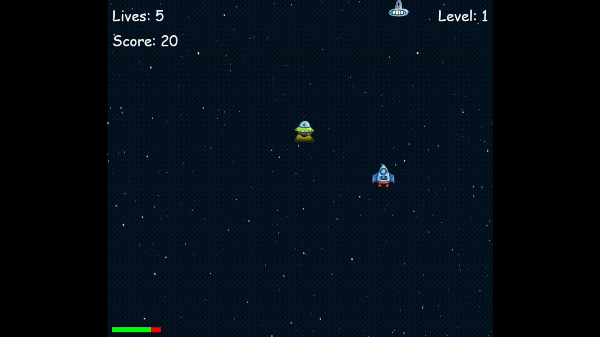
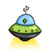
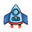

# Space Invaders

Забавна игричка за разцъкване :D

## 🚀 Характеристики
- Pixel graphic game (но не толкова пикселизирана)
- Увеличаване на нивата на трудност
- Брой животи, спрямо колко извъмземни са пропуснати
- Проследяване на резултат и система показваща най-висок резултат
- Специален тип извъмземно (UFO) което boost-ва живота на играча, както и дава 2х recoil speed за 10 секунди

## 📜 Как се цъка
- Използвате бутоните `A`/`D` да се движите у лево и у десно, и съотведно `W`/`S` за нагоре и надолю
- Цъкваш `Space` да стреляш
- Унищожавайте всички изроди преди да са ви подминали
- Избягвайте "вражеския огън" и оцелейте възможно най-дълго

## 🎥 Кратко видео на играта в действие

## 🎥 Помощни източници
За създаването на играта съм използвал следните клипове:
- 🔗 (https://www.youtube.com/watch?v=Q-__8Xw9KTM)
- 🔗 (https://www.youtube.com/watch?v=8GF6O6vNXCc&list=PLhTjy8cBISEo3SzET7Fc3-b4miKWp41yX)  
както и няколко други. Възползвал съм се и от помощта на GTP.

Благодаря на приятелката ми **Никол Маркова** за създаването на изображенията на извъмземните и кораба.
### Изображенията

